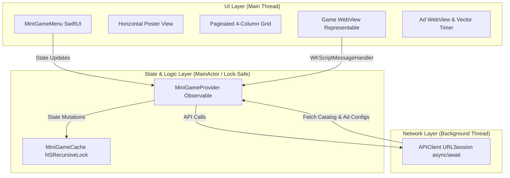

# Simula MiniGame SDK for iOS (Native Swift)

The **Simula MiniGame SDK** is a high-performance, native Swift library for iOS 16+ that allows publishers to seamlessly integrate conversational mini-games and premium programmatic advertisements into their applications. 

Designed strictly with **SwiftUI** and **Swift Concurrency (`async/await`)**, the SDK delivers a visually stunning, responsive user experience without ever blocking the main thread or causing UI jitter.

---

## Key Features

* **⚡ Ultra-Performance Architecture:** Entirely decoupled UI and state logic. Background tasks, network requests, and analytics reporting are safely offloaded using modern Swift Concurrency.
* **📱 Adaptive Layout Engine:** Fully responsive design adapting automatically to iOS size classes:
  * **Compact Class (iPhones):** A swipeable horizontal poster-card list utilizing high-fidelity press-scaling animations and native gesture handling.
  * **Regular Class (iPads / Landscape):** A horizontally paginated **4-column grid layout per page** with dynamic aspect-ratio scaling and a custom blue page indicator dot system.
* **🔒 Thread-Safe SDK Cache:** Protected by recursive locks (`NSRecursiveLock`), avoiding data races across background tasks and concurrent threads.
* **🎨 Fully Customizable Themes:** Deep control over colors, gradients, titles, fonts, and banners matching your app's brand aesthetics.
* **🌐 Web-Native Bridging:** Implements `WKWebView` wrappers with bidirectional JavaScript message bridges to report ad servers and load gameplay frames instantly.
* **📈 In-Game Fallback Ads & Countdown Ring:** Displays interactive sponsored ads with beautiful 5-second circular vector countdown timer overlays upon game dismissal.

---

## Core Architecture Diagram

The SDK follows an isolated, single-responsibility layered model:



---

## Installation

### Manual Integration
1. Drag the compiled `ad_sdk_ios.framework` into your Xcode project.
2. Select your Target, navigate to **General**, and add the framework to **Frameworks, Libraries, and Embedded Content**.
3. Set the embed type to **Embed & Sign**.

---

## Quick Start Guide

### 1. Initialize the SDK
Initialize and configure the SDK provider on your app launch or within your main content views. The configuration maps your specific publisher key and defaults domain bindings (like `"coolaigames.com"`) for Aditude slots:

```swift
import SwiftUI
import ad_sdk_ios

@main
struct CompanionApp: App {
    @StateObject private var provider = MiniGameProvider.shared
    
    var body: some Scene {
        WindowGroup {
            ContentView()
                .environmentObject(provider)
                .onAppear {
                    // Initialize with your API key
                    provider.configure(
                        apiKey: "pub_eeee14c661ce47659a289db29364723a",
                        devMode: false
                    )
                }
        }
    }
}
```

### 2. Present the MiniGameMenu (SwiftUI)
Bind a Boolean state to the catalog drawer overlay and inject the companion parameters. The SDK handles catalog fetching, session tracking, and responsive layout scaling automatically:

```swift
import SwiftUI
import ad_sdk_ios

struct ChatView: View {
    @EnvironmentObject private var provider: MiniGameProvider
    @State private var isMenuOpen = false
    
    var body: some View {
        ZStack {
            // Your Primary Conversation UI
            VStack {
                Button(action: { isMenuOpen = true }) {
                    HStack {
                        Image(systemName: "gamecontroller.fill")
                        Text("Play Games with Luna")
                    }
                    .padding()
                    .background(Color.blue)
                    .foregroundColor(.white)
                    .cornerRadius(12)
                }
            }
            
            // Full-screen MiniGame Responsive Drawer Overlay
            MiniGameMenu(
                isOpen: $isMenuOpen,
                charName: "Luna",
                charID: "char_luna_101",
                charImage: "https://example.com/luna-avatar.png",
                messages: [
                    Message(role: "user", content: "Hey Luna, let's play!"),
                    Message(role: "assistant", content: "Awesome! Click below to start.")
                ],
                onGameOpen: { gameName, description in
                    print("Started playing: \(gameName)")
                },
                onGameClose: { gameName in
                    print("Dismissed game: \(gameName)")
                }
            )
        }
    }
}
```

### 3. UIKit Integration
For traditional UIKit architectures, wrap the `MiniGameMenu` view inside a standard `UIHostingController` and present it dynamically over your view controller:

```swift
import UIKit
import SwiftUI
import ad_sdk_ios

class ChatViewController: UIViewController {
    private let provider = MiniGameProvider.shared
    private var isMenuOpen = false
    
    override func viewDidLoad() {
        super.viewDidLoad()
        
        // Configure SDK
        provider.configure(
            apiKey: "pub_eeee14c661ce47659a289db29364723a",
            devMode: false
        )
    }
    
    @objc func openMiniGamesMenu() {
        self.isMenuOpen = true
        let menuBinding = Binding<Bool>(
            get: { self.isMenuOpen },
            set: { self.isMenuOpen = $0 }
        )
        
        // Build the Menu view tree
        let menuView = MiniGameMenu(
            isOpen: menuBinding,
            charName: "Luna",
            charID: "char_luna_101",
            charImage: "https://example.com/luna-avatar.png"
        ).environmentObject(provider)
        
        let hostingController = UIHostingController(rootView: menuView)
        hostingController.modalPresentationStyle = .overFullScreen
        hostingController.view.backgroundColor = .clear
        
        present(hostingController, animated: true)
    }
}
```

---

## Detailed Customization & Theme Configurations

Use the `MiniGameTheme` struct during initialization to customize the overlay. The layout supports full hex-color formatting and maps theme elements dynamically:

```swift
var customTheme = MiniGameTheme(
    accentColor: "#00d2ff",         // Glowing cyan theme accent (buttons, indicators)
    backgroundColor: "#07070a",     // Solid dark backdrop container background
    titleFontColor: "#ffffff",      // Main text and header color
    cardBorderColor: "#1d1d26"      // Sleek subtle card borders
)

// Pass to the Menu Overlay
MiniGameMenu(
    isOpen: $isMenuOpen,
    charName: "Luna",
    charID: "char_luna_101",
    charImage: "https://example.com/luna-avatar.png",
    theme: customTheme
)
```

---

## Thread Safety and Performance Audit

To fulfill strict production SDK mandates, the library strictly guards system resources:
1. **Zero Main-Thread Blocks:** Network-bound API parsing, configuration downloads, and tracking posts utilize URLSession async pipelines executing completely off the UI thread.
2. **Lock-Protected Data States:** State cache elements are isolated through recursive locking:
   ```swift
   private let lock = NSRecursiveLock()
   
   func cacheAd(adId: String, iframeUrl: String) {
       lock.lock()
       defer { lock.unlock() }
       adCache[adId] = iframeUrl
   }
   ```
3. **Optimized Render Cycles:** Image rendering uses standard lazy asynchronous blocks (`AsyncImage`) caching remote media, avoiding catalog rendering lag.
4. **React Native Bridge Touch Resolution:** Bypasses React Native's standard `RCTTouchHandler` filters by presenting the catalog menu and game webviews modally (`.overFullScreen`) from a native UIKit window scene. This ensures 100% responsive snap carousel dragging and webview click actions with zero gesture freezes.
5. **Bridge `deinit` Unmount Safeguard:** Implements an explicit `deinit` destructor inside the native view manager. If a publisher abruptly unmounts the JS component (e.g., `{isOpen && <MiniGameMenu />}`), the Swift runtime automatically triggers view-controller dismissal on the main actor, preventing visual overlays from dangling or leaking memory.
6. **Zero-Overhead JS Mounting:** The React Native TypeScript layer returns a `null` render state immediately when `isOpen` is `false`. This avoids mounting, sizing, or maintaining inactive native component overlay views in the RN flexbox layout tree.

---

## License & Support
For SDK support, updates, or API credentials, contact the platform operations team or check your publisher portal dashboard.
